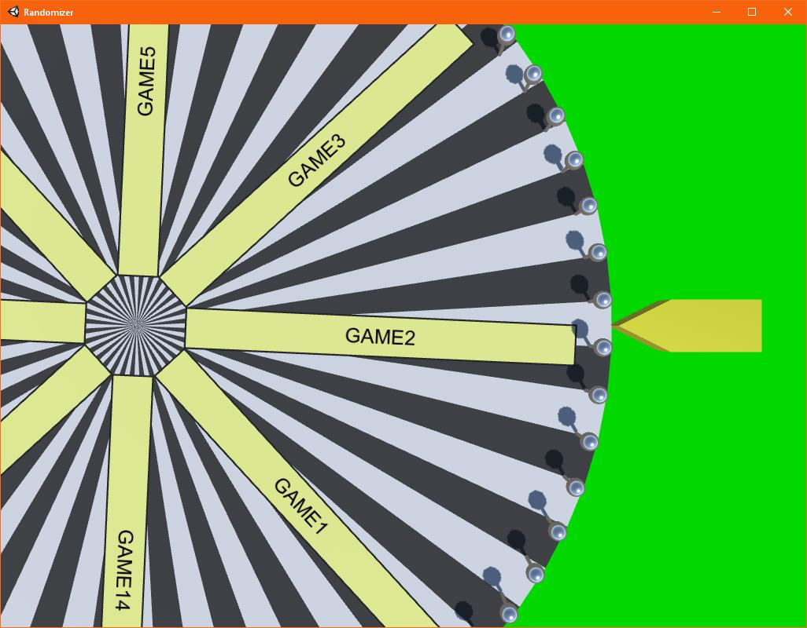

RANDOMIZER

This is thing for choosing random game from 10-20 with wheel of luck.

How to get source project:
git clone https://github.com/shikoist/randomizer.git

How to build:
Download and install
https://download.unity3d.com/download_unity/4550892b6062/Windows64EditorInstaller/UnitySetup64-2018.2.18f1.exe
Open project folder in Unity, File->Build and Run.

Screenshot:

Hotkeys:

Ctrl+H - shows\hides help

Ctrl+L - shows\hides games list editor

Ctrl+D - shows\hides debug panel

Ctrl+S - saves all

SPACE - rolls baraban

Ctrl+M - music ON/OFF

Game list saves to [UserName]\Documents\Randomizer\games.txt

Some options in [UserName]\Documents\Randomizer\options.ini

